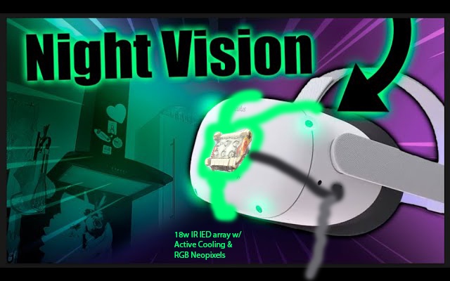
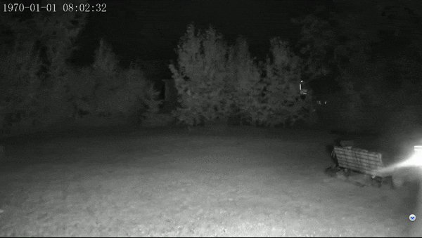
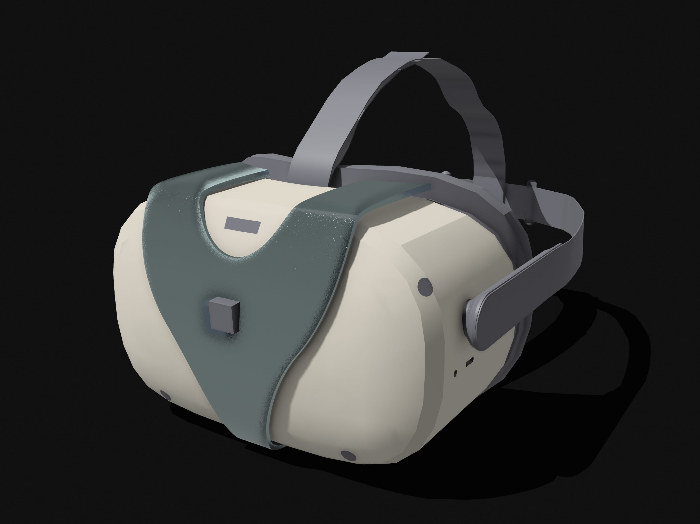
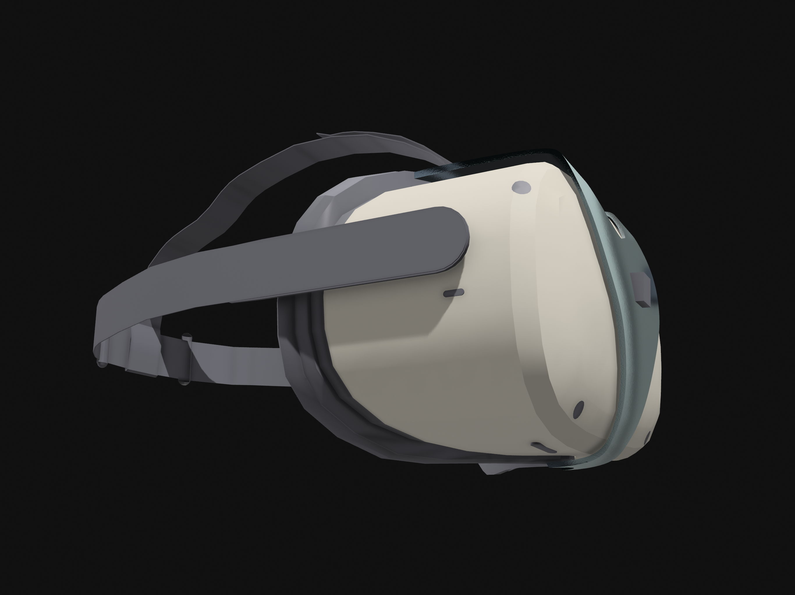
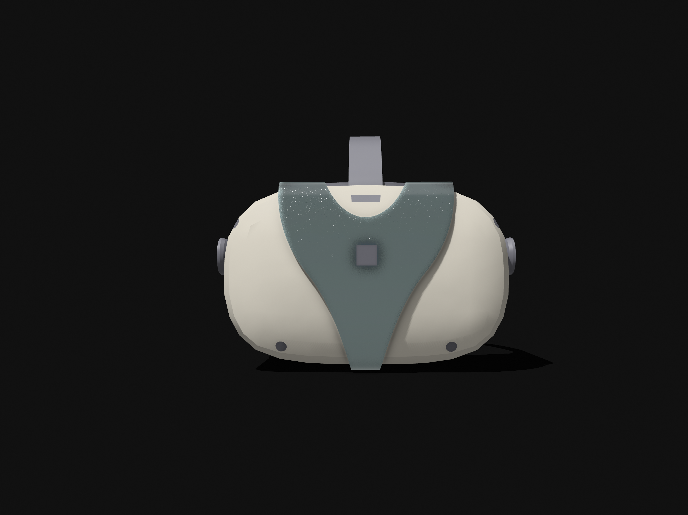
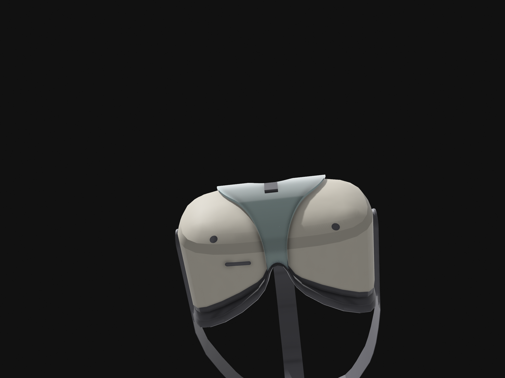
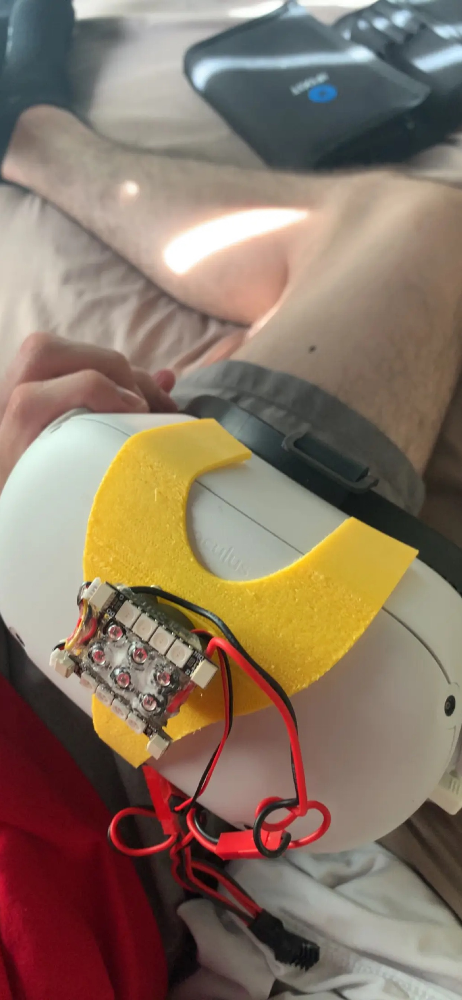
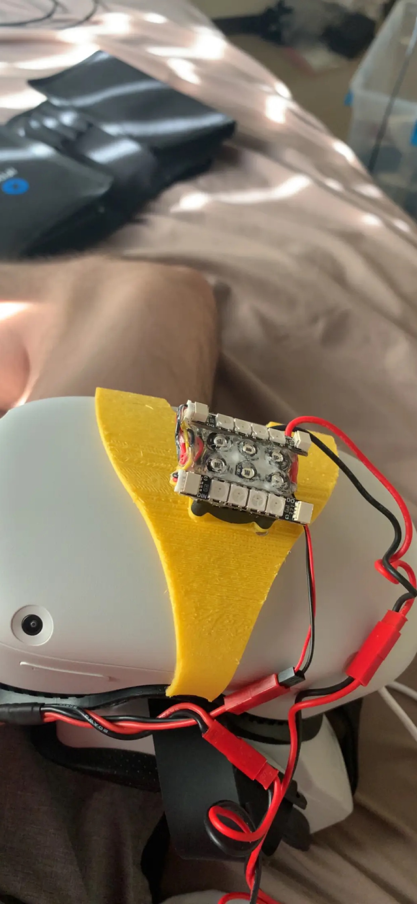
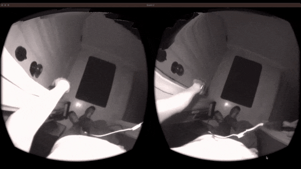
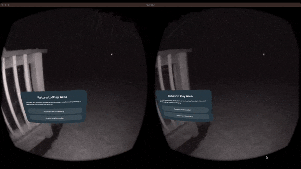

Discover NightQuestLED, the Quest 2's ultimate RGB companion. With an 18W IR LED array, transform night into day and play flawlessly in pitch black. Enhanced hand tracking ensures uninterrupted gameplay, while vibrant RGB lights set you apart in multiplayer action

## Benefits
- **Outdoor Adventures**: Use your Quest 2 outside and achieve precise tracking on the ground.
- **Distant Viewing**: Our LED combination enhances the IR sensitive cameras in the Quest 2, allowing you to see far-away objects with clarity.
- **Seamless Integration**: Designed to fit perfectly with your Quest 2, without adding any unnecessary bulk.

<!-- Scoped Bootstrap Carousel Styles -->

    <iframe src="https://collaborate.shapr3d.com/v/-aIgoza8qoZAO932ojAa-" title="Shapr3D Webviewer" frameborder="0" allow="web-share; xr-spatial-tracking" loading="lazy" scrolling="no" referrerpolicy="origin-when-cross-origin" allowfullscreen></iframe>

    <!-- Carousel -->
<!--     

        

            

                
            

            

                
            

            

                
            

            

                
            

            

                
            

        

        <a class="carousel-control-prev" href="#CADCarousel" role="button" data-slide="prev">
            
            ◀️
        </a>
        <a class="carousel-control-next" href="#CADCarousel" role="button" data-slide="next">
            
            ▶️
        </a>
    
 -->
    <!-- Physical Prototype Carousel -->
    

        

            

                
            

            

                
            

        

        <a class="carousel-control-prev" href="#PhysicalProtoCarousel" role="button" data-slide="prev">
            
            ◀️
        </a>
        <a class="carousel-control-next" href="#PhysicalProtoCarousel" role="button" data-slide="next">
            
            ▶️
        </a>
    

<!-- Add Bootstrap and jQuery JS for carousel functionality -->

 

## Explore your house in even in pitch black
\

## Play VR games late at night without disturbing your apartment mates

## Explore the Outdoors with Super-Human Night Vision
\
\

## DIY Kit & Savings
Love tinkering and 3D printing? We've got great news! Download the 3D files for the Quest mount absolutely free and print your own mount. Opt for this DIY route, and you'll receive a $10 discount on your purchase. Buy our PCB/electronics kit for just $20, and with a quick assembly time of under 15 minutes (excluding print time), you'll have your NightQuestLED ready to roll!

## ESP32 Onboard: Powering Infinite Possibilities
Harness the power of our onboard ESP32 microcontroller. A cornerstone feature, it allows you to:

**Open Source Firmware**: Customize and modify the device firmware to suit your unique needs. Dive into the code and make it yours.

**Over-the-Air (OTA) Updates**: As we innovate and improve, get firmware updates directly to your device without any hassle.

**Bluetooth Communication**: Seamlessly connect the NightQuestLED to your Quest 2 via Bluetooth. This integration opens up a realm of real-time interactions, such as adjusting the RGB or IR LED based on game dynamics or ambient conditions.

**Dynamic Adjustments with Quest's Passthrough API**: In a future software release we will add the capability for the IR & RGB LEDs to adjust their brightness in tandem with the ambient light changes detected by the cameras of the Quest 2, enabling perfect lighting, every time.

**Shared Space Multiplayer Enhancements**: With the rise of shared-space VR experiences, use the RGB to signify teams, player statuses, and more. Whether you're in a competitive match or a collaborative effort, let the RGB tell the story.

**Versatile Lighting**: Need more illumination? Switch the RGB NeoPixels to act as powerful white LEDs, ensuring optimal visibility even in vast, dark environments.

The potential is vast. With NightQuestLED, you're not just buying a product; you're stepping into a world of endless VR enhancements and possibilities.

# Features
### 18 W Infrared LED Array
Our powerful infrared LED array ensures that your Quest 2 never loses track, even in the darkest environments. Experience smooth, uninterrupted gameplay or exploration, wherever you are. 

### 5 W RGB NeoPixel Array
Illuminate your surroundings with our vibrant neo pixel array, adding a touch of brilliance to your VR experience.

### Customizable Plastic Mount
If you don't like the options you can purchase from us, you can 3D print at home your own mount to attach the electronics to the quest 2. You can print it in whatever plastic you'd like, print replacements, or re-use the mount for your own purpuses. 

### USB C PD with Power Passthrough
Stay powered up without interruptions. Our device supports USB C Power Delivery (PD) with a passthrough feature. Connect a USB C PD cable to NightQuestLED and simultaneously power the LEDs while charging your Quest 2. Game on without worrying about battery drain.

## Installation
Easily attach nightquestLED to your Quest 2 and experience the difference in minutes. [Link to a potential installation guide or video]

## Safety Precautions
Your safety is paramount. Always ensure:
- Do not look directly into the LEDs for extended periods of time. Humans cannot see IR light, but it carries energy like all other wavelenghts, while likely safe at the power levels used, it has not been independently tested and declared safe yet. 
- The device might get hot, avoid touching it for 1 minute after turning off the IR LEDs

## Pricing and Purchase
Unlock a new dimension in VR for just $30. Buy now

## About Us
todo

## Testimonials
"NightQuestLED transformed my VR experience!" - [Name]

[Other testimonials or reviews]

## Contact
Have questions or feedback? Reach out at [email] or follow us on 
